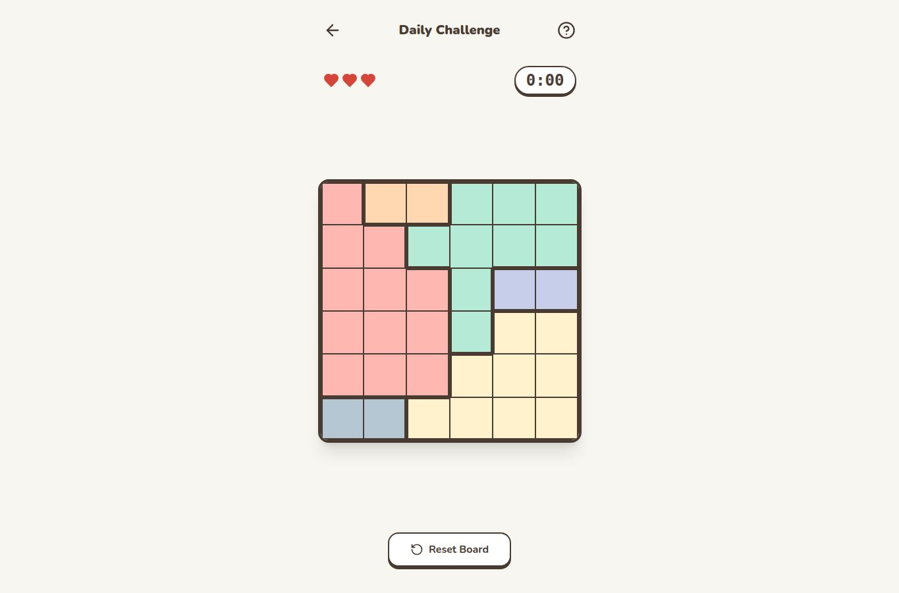
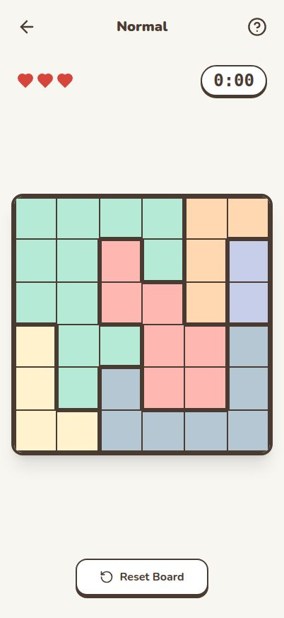

# ZouZou & Friends

A cat logic puzzle for a small group of friends: one shared daily puzzle, a leaderboard,
streaks, and endless easy / medium / hard games. It runs in the browser on phone or desktop,
with no sign-up.

Play the original at https://zouzou.minus1over12.com, or host your own copy (see [Self-hosting](#self-hosting)).

<p>
  
  
</p>

## How to play

- Place exactly **one cat in every row, column and coloured region**.
- Cats **can't touch each other**, not even diagonally.
- Tap once to mark "no cat" and tap again to clear it. Double-tap to place a cat. Drag to mark (or
  erase) several cells at once.
- A wrong cat costs a life. When you run out of lives, the game is over.

| Mode | Board | Lives | Notes |
|---|---|---|---|
| Easy | 6×6 | 5 | One cat pre-placed |
| Medium | 8×8 | 4 | |
| Hard | 10×10 | 3 | |
| Daily | varies | varies | Everyone gets the same puzzle; its difficulty comes from the date. One completion per day |

- **Day** means the **America/Edmonton** date, on both the client and the server.
- **Daily streak:** goes up by one for each consecutive day you win the daily. A missed day, or
  running out of lives on the daily, resets it.
- **Leaderboard:** keeps each player's best time for the day and shows the top 10. Names match
  case-insensitively.
- **Your data:** best times, streak and player name live in a browser cookie (`zouzou-player`).
  Shared scores and game history live in D1.

## Architecture

One Cloudflare Worker serves everything from a single origin:

```
browser ──► your Worker   (<your-subdomain>.workers.dev or a custom domain)
              ├─ /api/*  → Hono app (artifacts/worker) → D1 database (binding DB)
              └─ else    → static assets: Vite build of artifacts/zouzou-friends
                           (SPA fallback → index.html)
```

- **Client:** React 19, Vite 7, Tailwind 4, wouter and TanStack Query. Puzzles are generated in the
  browser, so the server never sees a board.
- **API:** Hono on Cloudflare Workers. Requests are validated with Zod schemas generated from the
  OpenAPI spec.
- **Data:** Cloudflare D1 (SQLite). Every day's scores and every game played are kept.
- **Contract-first:** `lib/api-spec/openapi.yaml` feeds Orval, which generates Zod schemas (used by
  the Worker) and React Query hooks (used by the client).
- **Hosting:** fits in the Cloudflare Free plan. `noindex` is set everywhere (`index.html`,
  `public/_headers`, and the Worker's `X-Robots-Tag`); this is a friends' game, not a public site.

## Repo layout

```
wrangler.jsonc                 Worker config: assets, SPA fallback, /api/* routing, D1 binding
artifacts/
  zouzou-friends/              the game (React + Vite) → dist/public
    public/_headers            security headers + noindex for static responses
  worker/
    src/index.ts               Hono API
    migrations/                D1 schema (0001_init.sql, ...)
    scripts/repldb-to-sql.mjs  legacy one-off import; not needed for a new install
    worker-configuration.d.ts  generated Worker types (pnpm --filter @workspace/worker run cf-typegen)
lib/
  api-spec/                    openapi.yaml + Orval config (the API contract)
  api-zod/                     generated Zod schemas
  api-client-react/            generated React Query hooks
screenshots/
```

## API

All routes live under `/api` and return JSON.

| Method | Path | Body | Returns |
|---|---|---|---|
| GET | `/api/healthz` | | `{ "status": "ok" }` |
| GET | `/api/daily/leaderboard` | | `{ date, entries: [{ name, seconds }] }`: today's top 10 |
| POST | `/api/daily/leaderboard` | `{ name, seconds }` | the updated board; keeps the player's best time |
| GET | `/api/players/recent` | | `{ entries: [{ name, date, game, seconds }] }`: latest game per player, newest first |
| POST | `/api/players/games` | `{ name, game, seconds }` | the recorded entry |

Limits:
- `name`: 1–24 characters. Whitespace is collapsed, and names are matched case-insensitively.
- `seconds`: a whole number from 1 to 36000.
- `game`: one of `daily`, `easy`, `medium`, `hard`.

Invalid input gets a `400 { "error": … }` response, and an unknown route gets `404`.

```bash
curl -s http://localhost:8787/api/daily/leaderboard | jq .
```

## Local development

Prerequisites:
- Node 24 (see `.nvmrc`)
- pnpm 10.34.5 (`npm i -g pnpm@10.34.5`, pinned via `packageManager`)
- A Cloudflare account is **not** needed for local development

```bash
pnpm install

# Full stack: Worker + static assets + local D1, at http://localhost:8787
pnpm --filter @workspace/zouzou-friends run build
pnpm exec wrangler d1 migrations apply zouzou --local
pnpm exec wrangler dev --local --port 8787

# Client only, with Vite hot reload (API calls need the Worker running)
pnpm --filter @workspace/zouzou-friends run dev
```

`wrangler` is a pinned dev dependency. Run it with `pnpm exec wrangler` or `npx wrangler`; no
global install is needed. Local D1 data lives in `.wrangler/state` and never touches Cloudflare.

### Checks

```bash
pnpm run typecheck    # libs + worker + client
pnpm run build        # typecheck, then build the client
```

There's no automated test suite yet. Changes are verified with typecheck, build, a `wrangler dev`
smoke test and manual play.

### Changing the API

1. Edit `lib/api-spec/openapi.yaml`. Use `type: number` with bounds rather than `integer`, because
   the generated Zod doesn't support `.int()`. Enforce whole numbers in the route instead.
2. Run `pnpm --filter @workspace/api-spec run codegen`.
3. Update `artifacts/worker/src/index.ts`.

### Changing the database

- Migrations are append-only: never edit one that has been applied; add
  `artifacts/worker/migrations/000N_<name>.sql`.
- Apply locally with `pnpm exec wrangler d1 migrations apply zouzou --local`, and to your hosted
  database with `--remote` before deploying code that depends on the change.
- If you change bindings or `compatibility_date` in `wrangler.jsonc`, regenerate types with
  `pnpm --filter @workspace/worker run cf-typegen`.

## Self-hosting

You need a Cloudflare account (the Free plan is enough). `wrangler.jsonc` points at the original
game's D1 database, so you must swap in your own.

1. **Log in:** `pnpm exec wrangler login`
2. **Create a D1 database:** `pnpm exec wrangler d1 create zouzou`. Copy the `database_id` it
   prints.
3. **Point the config at it:** in `wrangler.jsonc`, replace the `database_id` value with
   `<your-database-id>`. If you picked a different database name, update `database_name` too and
   use that name in the commands below. Optionally change the Worker `name`.
4. **Create the tables:** `pnpm exec wrangler d1 migrations apply zouzou --remote`
5. **Deploy**, either way:
   - **From your machine:** `pnpm run build && pnpm exec wrangler deploy`. The game is served at
     `https://zouzou.<your-subdomain>.workers.dev`.
   - **Workers Builds (deploy on push):** in the Cloudflare dashboard, Workers & Pages › Create ›
     import your fork. Use build command `pnpm install --frozen-lockfile && pnpm run build` and
     deploy command `npx wrangler deploy`. The Worker name in the dashboard must match `name` in
     `wrangler.jsonc`. Note that preview builds of other branches use the same D1 database.
6. **Check it:** `curl -s https://zouzou.<your-subdomain>.workers.dev/api/healthz` returns
   `{"status":"ok"}`.

Optional:
- **Custom domain:** if the domain's zone is on your Cloudflare account, add it under Worker ›
  Settings › Domains & Routes › Custom domain.
- **Rate limiting:** the API has no auth, so anyone with the URL can post scores. A zone rate-limit
  rule on paths starting with `/api/` (for example, block an IP for 10 s after 10 requests in 10 s)
  limits abuse. Requires a custom domain; rules apply to the zone, not `workers.dev`.
- **Search indexing:** to allow it, remove the `noindex` lines listed under Architecture.

### Backups and rollback

- **Backup:** `pnpm exec wrangler d1 export zouzou --remote --output=<path outside the repo>`.
  Exports contain players' names; don't commit them.
- **Code rollback:** Worker › Deployments › Rollback, or `pnpm exec wrangler rollback`.
- **Data rollback:** code rollbacks don't touch D1. D1 Time Travel restores to an earlier point
  (`wrangler d1 time-travel info` / `restore`); restore is destructive, and retention depends on
  your plan.

## Project history and docs

Built with Replit Agent in Aug 2026 and moved to Cloudflare Workers + D1 in Sep 2026. Project docs
and agent instructions: `CLAUDE.md`, `PROJECT.md`, `PLAN.md`, `STATE.md`, `DECISIONS.md`.
